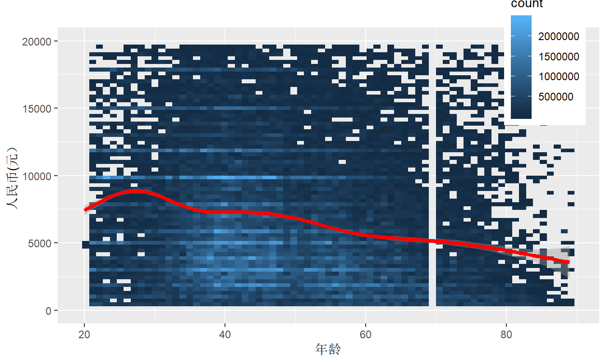
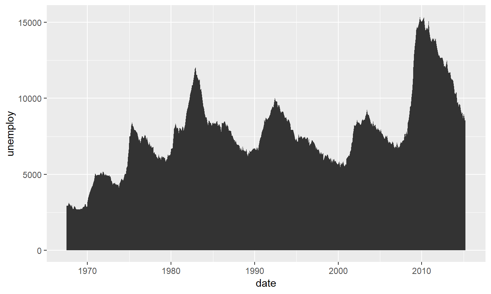
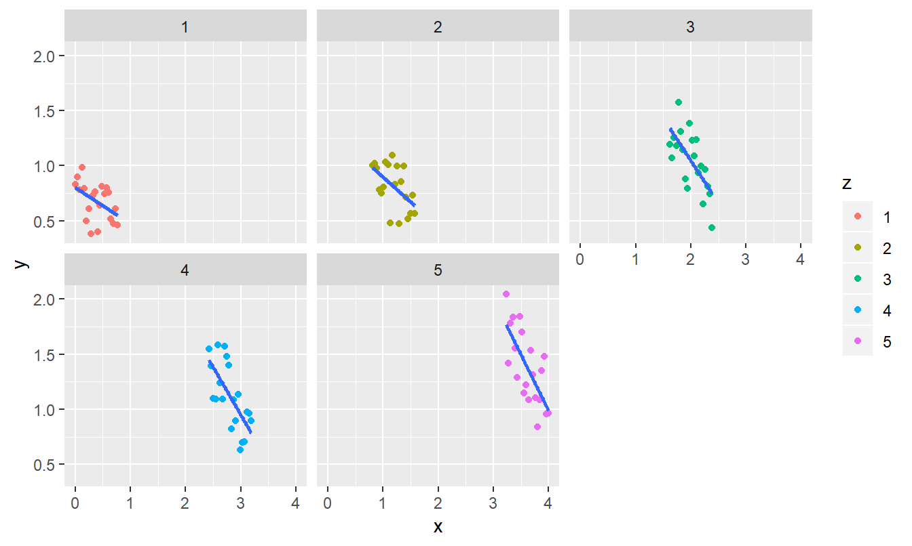

本文链接：

<https://xsong.ltd/archives/ggplot/ggplot2prac>

---

`ggplot2` see Figure \@ref(fig:fig1) 

[如何使用ggplot2?](https://mp.weixin.qq.com/s/mlfCRrd0CMzoYpuCSqsVtQ)

[用局部加权回归散点平滑法观察二维变量之间的关系](https://cosx.org/2008/11/lowess-to-explore-bivariate-correlation-by-yihui)


```r
library(ggplot2)
data(diamonds)
knitr::kable(head(diamonds),caption="数据概要",align='c')
```


Table: 数据概要

 carat       cut       color    clarity    depth    table    price     x       y       z   
-------  -----------  -------  ---------  -------  -------  -------  ------  ------  ------
 0.23       Ideal        E        SI2      61.5      55       326     3.95    3.98    2.43 
 0.21      Premium       E        SI1      59.8      61       326     3.89    3.84    2.31 
 0.23       Good         E        VS1      56.9      65       327     4.05    4.07    2.31 
 0.29      Premium       I        VS2      62.4      58       334     4.20    4.23    2.63 
 0.31       Good         J        SI2      63.3      58       335     4.34    4.35    2.75 
 0.24     Very Good      J       VVS2      62.8      57       336     3.94    3.96    2.48 

```r
#原始变量关系
ggplot(diamonds, aes(carat,price)) +
geom_bin2d() +
facet_wrap(~cut, nrow = 2)
```


```r
#y变量取对数
ggplot(diamonds, aes(log(carat),price)) +
geom_point() +
facet_wrap(~cut, nrow = 2)
```


```r
#x变量取对数
ggplot(diamonds, aes(carat,log(price))) +
geom_bin2d() +
facet_wrap(~cut, nrow = 2)
```


```r
#都取对数，最终成为线性关系。
ggplot(diamonds, aes(log(carat), log10(price))) +
geom_bin2d(bins = 100) +
facet_wrap(~cut, nrow = 2)
```


```r
library(haven)
setwd("E:/R_codes/capplot")
X2010 <- read_dta("2010.dta")
xy <- read_dta("id.dta")
hho <- read_dta("aggregrate.dta")
nrow(hho)
```

```
[1] 53225
```

```r
set.seed(13)#设置随机数种子
sample <- sample(1:nrow(hho),600,replace = F)#抽取600个样本
hhosampled <- hho[sample,]#抽取
nrow(hhosampled)
```

```
[1] 600
```

```r
library(ggplot2)
scattered <- ggplot(hho,aes(x=agem,y=inc,group=type,shape=type,color=type,weight=fswt_nat)) +
  ylim(0, 20000) +
  labs(title = " ",x = "年龄",y = "人民币(元）")+
  geom_smooth(span = 10,size=1.5) + 
  geom_point(data = hhosampled, alpha = 4/7,size = 2.5 )  +
  annotate("text", x = 70, y = 200, label="数据来源：CFPS,正常散点", size = 4) + #注解
  theme(legend.position = c(0.9,0.9))#图例位置
scattered
```


```r
scattered2 <- ggplot(hho,aes(x=agem,y=inc,weight=fswt_nat)) +
  ylim(0, 20000) +
  labs(title = " ",x = "年龄",y = "人民币(元）")+
  geom_bin2d(bins = 70)  +
  geom_smooth(span = 10,size=1.5,colour='red') +
  annotate("text", x = 70, y = 200, label=" ", size = 4) + #注解
  theme(legend.position = c(0.9,0.9))#图例位置
scattered2
```

<div class="figure" style="text-align: center">

<p class="caption">(\#fig:fig1)fig1</p>
</div>


```r
i <- ggplot(economics, aes(date, unemploy))
i + geom_area()
```



```r
i + geom_line()
```


```r
set.seed(711)
x = seq(0, 4, length = 100)
y = -x + jitter(rep(1:5, each = 20), 2)
z = rep(1:5, each = 20)
z <- as.factor(z)
moto <- data.frame(x,y,z)
lm1 <- lm(y ~ z,moto)
moto <- within(moto,res <- residuals(lm1))
moto1 <- subset(moto,z==1)
moto2 <- subset(moto,z==2)
moto3 <- subset(moto,z==3)
moto4 <- subset(moto,z==4)
moto5 <- subset(moto,z==5)

ggplot(moto, aes(x, y)) +
  geom_point(aes(color = z),size=3) +
  geom_smooth(method='lm',se=F)
```


```r
ggplot(moto, aes(x, y)) +
  geom_point(aes(color = z)) +
  facet_wrap(~z, nrow = 2) +
  geom_smooth(method='lm',se=F)
```




```r
ggplot(moto, aes(x,y),group=z)+
  geom_point(aes(color = z),size=3) +
  geom_smooth(data = moto1,method='lm',se=F)+
  geom_smooth(data = moto2,method='lm',se=F)+
  geom_smooth(data = moto3,method='lm',se=F)+
  geom_smooth(data = moto4,method='lm',se=F)+
  geom_smooth(data = moto5,method='lm',se=F)
```


  
