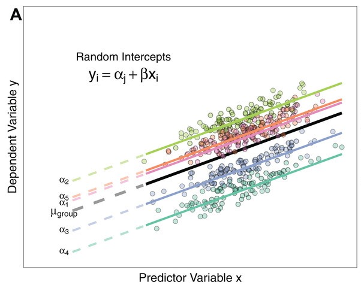

# Let's Start!
``````{r Intro, echo=F, fig.cap=" ", out.width = '55%',fig.align='center'}
knitr::include_graphics("https://timgsa.baidu.com/timg?image&quality=80&size=b9999_10000&sec=1559987331910&di=a089e476c808440db9f7a356b7096f51&imgtype=0&src=http%3A%2F%2Fpic4.zhimg.com%2Fv2-ea8103bf18ea17c1320dfceadf9f580f_b.gif")

```

---

## 数据介绍
.mid[
+ 1988 年**中国居民收入调查**(CHIP)数据

+ 由中国社会科学院经济研究所主持。

+ 分阶段抽样：

  + 先从30 个省级行政单位中抽选出10 个省份。
  
  + 再从这10个省份的434个城市中抽选出55个城市。
  
  + 在55个城市中，共调查9009 户家庭。


+ 调查问卷收集了每一户中所有家庭成员的资料。在删除缺失数据和不完整观测个案之后，总共得到15862条居民个体的观测数据。
]
---

## 研究问题
.large[
+ 研究经济改革的成功与个人收入决定因素之间的关系
]
---

## 变量
.mid[
+ 因变量：
  + 收入的自然对数值

+ 个人变量：
  + <font color=#FF0000>教育年限</font>
  + 工作年限(即工龄)
  + 党员身份的虚拟变量(1=党员, 0=非党员)
  + 性别的虚拟变量(1=女性, 0=男性)

+ 城市层面变量：
  + 1985年和1988年之间各城市工业总产值(GPVI)的变化
  
$${Z_j} = \log (GPV{I_{1988}}/GPV{I_{1985}})$$
]


---
class: center, middle

# 模 型

---


## 零模型(ANOVA)
.mid[
 + 层1： 
 
$${y_{ij}} = {\beta _{0j}} + {\varepsilon _{ij}}$$
 + 层2：
 
$${\beta _{0j}} = {\gamma _{00}} + {\mu _{0j}}$$
 + 组合模型
 
$${y_{ij}} = {\gamma _{00}} + {\mu _{0j}} + {\varepsilon _{ij}}$$

其中,
${\beta _{0j}}$是第j个层2单位的平均值,

$\gamma_{00}$表示样本整体中因变量的总平均值(grand mean) ,

${\mu _{0j}}$是与第j个层2单位相联系的随机效应
]
---
## 随机截距模型
.mid[
+ 层1：

$${{\rm{y}}_{ij}} = {\beta _{0j}} + {\beta _{1j}}({x_{ij}} - {{\bar x}_{ \cdot j}}) + {\varepsilon _{ij}}$$


+ 层2：

$${\beta _{0j}} = {\gamma _{00}} + {\mu _{0j}}$$

+ 组合模型

$${{\rm{y}}_{ij}} = \underbrace {{\beta _{1j}}({x_{ij}} - {{\bar x}_{ \cdot j}})}_{fixed{\rm{ }}\ effect} + \underbrace {{\gamma _{00}} + {\mu _{0j}} + {\varepsilon _{ij}}}_{random{\rm{ }}\ effect}$$

其中,
$\gamma_{00}$表示层2 所有单位的回归截距的平均值。

$\gamma_{10}$表示层2 所有单位的回归斜率的平均值。
]
---
## 随机截距模型

```{r sur2, echo=F, fig.cap=" ", out.width = '70%',fig.align='center'}

```


---

## 随机系数模型
.mid[
+ 层1：

$${{\rm{y}}_{ij}} = {\beta _{0j}} + {\beta _{1j}}({x_{ij}} - {{\bar x}_{ \cdot j}}) + {\varepsilon _{ij}}$$

+ 层2：

$${\beta _{0j}} = {\gamma _{00}} + {\mu _{0j}}$$
$${\beta _{1j}} = {\gamma _{10}} + {\mu _{1j}}$$

组合模型：
$${{\rm{y}}_{ij}} = \underbrace {{\gamma _{00}} + {\gamma _{10}}({x_{ij}} - {{\bar x}_{ \cdot j}})}_{fixed{\rm{ }}\ effect} + \underbrace {{\mu _{0j}} + {\mu _{1j}}({x_{ij}} - {{\bar x}_{ \cdot j}}) + {\varepsilon _{ij}}}_{random{\rm{ }}\ effect}$$


]


---
## 随机系数模型

```{r sur1, echo=F, fig.cap=" ", out.width = '70%',fig.align='center'}
knitr::include_graphics("random2.jpg")
```


---
### 完全模型(引入层2解释变量)

#### 将截距和斜率作为结果的回归模型

 + 层1： 
 
$${y_{ij}} = {\beta _{0j}} + {\beta _{1j}}{x_{ij}} + {\varepsilon _{ij}}$$
 + 层2：
 
$${\beta _{0j}} = {\gamma _{00}} + {\gamma _{01}}{Z_j} + {\mu _{0j}}$$

$${\beta _{1j}} = {\gamma _{10}} + {\gamma _{11}}{Z_j} + {\mu _{1j}}$$

+ 代入得到：

$${y_{ij}} = \underbrace {{\gamma _{00}} + {\gamma _{01}}{Z_j} + {\gamma _{10}}{x_{ij}} + {\gamma _{11}}{Z_j}{x_{ij}}}_{fixed{\rm{ }}\ effect} + \underbrace {{\mu _{0j}} + {\mu _{1j}}{x_{ij}} + {\varepsilon _{ij}}}_{random{\rm{ }}\ effect}$$

${Z_j}$
为层2解释变量，为第j个城市的工业总产值(GPVI)的变化

---
class: center, middle

# Stata 命令
---
## 命令示例

+ **geo**为层2标识变量  

+ **z**为层2解释变量。1985年和1988年之间各城市工业总产值(GPVI)的变化，<font color=#FF0000> **z**越大，则该城市经济发展越快</font> 。

```sql

/*零模型*/
mixed LogY || geo: , variance

/*随机截距模型*/
mixed LogY x1 || geo: , variance

/*随机系数模型*/
mixed LogY x1 || geo: x1, variance

/*完全模型*/
mixed LogY x1 z x1#z || geo: x1, variance


```
---
## 对中

```sql
/*组均值对中*/
sort geo
*by geo: egen edumean = mean(edu) 
g cen_edu = edu - edumean

```
---

## 零模型运行结果

```python 
*. mixed logearn || geo: , variance

Performing EM optimization: 

Performing gradient-based optimization: 

Iteration 0:   log likelihood = -7978.9487  
Iteration 1:   log likelihood = -7978.9487  (backed up)

Computing standard errors:

*Mixed-effects ML regression                     Number of obs     =     15,862
*Group variable: geo                             Number of groups  =         55

                                                Obs per group:
                                                              min =         80
                                                              avg =      288.4
                                                              max =      1,096

                                                Wald chi2(0)      =          .
Log likelihood = -7978.9487                     Prob > chi2       =          .

```

---

```python 


------------------------------------------------------------------------------
     logearn |      Coef.   Std. Err.      z    P>|z|     [95% Conf. Interval]
-------------+----------------------------------------------------------------
*      _cons |   7.421528   .0254612   291.48   0.000     7.371625     7.47143
------------------------------------------------------------------------------

------------------------------------------------------------------------------
  Random-effects Parameters  |   Estimate   Std. Err.     [95% Conf. Interval]
-----------------------------+------------------------------------------------
geo: Identity                |
*                 var(_cons) |   .0348887   .0068122      .0237949    .0511547
-----------------------------+------------------------------------------------
               var(Residual) |   .1579178   .0017763      .1544744     .161438
------------------------------------------------------------------------------
LR test vs. linear model: chibar2(01) = 2377.51       Prob >= chibar2 = 0.0000

```
---
## 随机截距模型

```sql
*. mixed logearn cen_edu || geo: , variance

Performing EM optimization: 

Performing gradient-based optimization: 

Iteration 0:   log likelihood = -7838.2144  
Iteration 1:   log likelihood = -7838.2144  

Computing standard errors:

Mixed-effects ML regression                     Number of obs     =     15,862
Group variable: geo                             Number of groups  =         55

                                                Obs per group:
                                                              min =         80
                                                              avg =      288.4
                                                              max =      1,096

                                                Wald chi2(1)      =     283.99
Log likelihood = -7838.2144                     Prob > chi2       =     0.0000

```
---

```sql
------------------------------------------------------------------------------
     logearn |      Coef.   Std. Err.      z    P>|z|     [95% Conf. Interval]
-------------+----------------------------------------------------------------
*    cen_edu |   .0172395    .001023    16.85   0.000     .0152345    .0192446
*      _cons |   7.421519   .0254621   291.47   0.000     7.371614    7.471424
------------------------------------------------------------------------------

------------------------------------------------------------------------------
  Random-effects Parameters  |   Estimate   Std. Err.     [95% Conf. Interval]
-----------------------------+------------------------------------------------
geo: Identity                |
*                 var(_cons) |   .0349047   .0068124      .0238096    .0511699
-----------------------------+------------------------------------------------
               var(Residual) |   .1551307    .001745       .151748    .1585888
------------------------------------------------------------------------------
LR test vs. linear model: chibar2(01) = 2420.35       Prob >= chibar2 = 0.0000


```
---
## 随机系数模型

```sql
*. mixed logearn cen_edu || geo: cen_edu, variance

Performing EM optimization: 

Performing gradient-based optimization: 

Iteration 0:   log likelihood = -7823.6964  
Iteration 1:   log likelihood = -7823.6964  

Computing standard errors:

Mixed-effects ML regression                     Number of obs     =     15,862
Group variable: geo                             Number of groups  =         55

                                                Obs per group:
                                                              min =         80
                                                              avg =      288.4
                                                              max =      1,096

                                                Wald chi2(1)      =     106.60
Log likelihood = -7823.6964                     Prob > chi2       =     0.0000

```
---
```sql
------------------------------------------------------------------------------
     logearn |      Coef.   Std. Err.      z    P>|z|     [95% Conf. Interval]
-------------+----------------------------------------------------------------
*    cen_edu |    .016245   .0015734    10.32   0.000     .0131612    .0193288
       _cons |   7.421517   .0254624   291.47   0.000     7.371612    7.471422
------------------------------------------------------------------------------

------------------------------------------------------------------------------
  Random-effects Parameters  |   Estimate   Std. Err.     [95% Conf. Interval]
-----------------------------+------------------------------------------------
geo: Independent             |
*               var(cen_edu) |   .0000667   .0000246      .0000323    .0001376
                  var(_cons) |   .0349087   .0068126      .0238133     .051174
-----------------------------+------------------------------------------------
               var(Residual) |   .1544599   .0017402      .1510866    .1579085
------------------------------------------------------------------------------
LR test vs. linear model: chi2(2) = 2449.38               Prob > chi2 = 0.0000

Note: LR test is conservative and provided only for reference.

```
---
## 完全模型

```sql
*. mixed logearn cen_edu exp cpc sex gross_d c.cen_edu#c.gross_d || geo:exp cpc sex cen_
> edu, variance

Mixed-effects ML regression                     Number of obs     =     15,862
Group variable: geo                             Number of groups  =         55

                                                Obs per group:
                                                              min =         80
                                                              avg =      288.4
                                                              max =      1,096

                                                Wald chi2(6)      =    2628.79
Log likelihood = -5403.8032                     Prob > chi2       =     0.0000

```
---

## 完全模型：固定系数部分

```sql

-------------------------------------------------------------------------------------
            logearn |      Coef.   Std. Err.      z    P>|z|     [95% Conf. Interval]
--------------------+----------------------------------------------------------------
*           cen_edu |   .0380013   .0032783    11.59   0.000     .0315759    .0444268
                exp |   .0174375   .0004236    41.17   0.000     .0166074    .0182677
                cpc |   .0822814   .0081615    10.08   0.000     .0662852    .0982776
                sex |  -.1015378   .0097093   -10.46   0.000    -.1205677    -.082508
*           gross_d |   .4608808   .1000528     4.61   0.000      .264781    .6569806
                    |
*c.cen_edu#c.gross_d |  -.0121546   .0064393    -1.89   0.059    -.0247754    .0004662
                    |
              _cons |   6.887406   .0521607   132.04   0.000     6.785173    6.989639
-------------------------------------------------------------------------------------
```
---
## 完全模型：随机系数部分

```python
------------------------------------------------------------------------------
  Random-effects Parameters  |   Estimate   Std. Err.     [95% Conf. Interval]
-----------------------------+------------------------------------------------
geo: Independent             |
                    var(exp) |   3.89e-06   1.54e-06      1.79e-06    8.45e-06
                    var(cpc) |   .0005872   .0005456       .000095    .0036279
                    var(sex) |   .0030459   .0008939      .0017135    .0054142
*               var(cen_edu) |   .0000554   .0000194      .0000279    .0001099
                  var(_cons) |   .0255124   .0052168      .0170882    .0380897
-----------------------------+------------------------------------------------
               var(Residual) |   .1130884   .0012793      .1106086    .1156238
------------------------------------------------------------------------------
LR test vs. linear model: chi2(5) = 2591.96               Prob > chi2 = 0.0000

Note: LR test is conservative and provided only for reference.


```


---
## 结论
.large[
+ 改革开放时期中国的地区异质性会影响中国的人力资本回报率。

+ 交互项系数为负。经济发展水平越高的地区，教育回报率越低。
]


---
class: center, middle

# 谢谢!
``````{r end, echo=F, fig.cap=" ",out.width = '60%',fig.align='center'}
knitr::include_graphics("https://timgsa.baidu.com/timg?image&quality=80&size=b9999_10000&sec=1559921618412&di=f118b115bf4ab9ab74be09f366906204&imgtype=0&src=http%3A%2F%2Fb-ssl.duitang.com%2Fuploads%2Fitem%2F201809%2F12%2F20180912072220_qivjj.thumb.700_0.gif")
```


