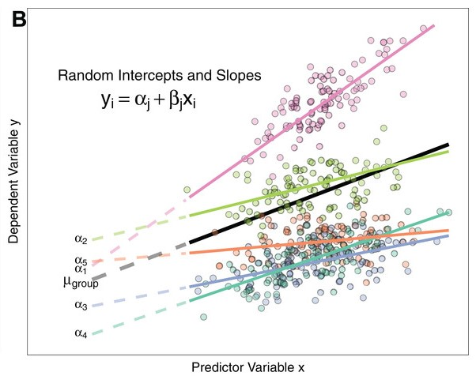

---

# 数据介绍
.mid[
+ 1988 年**中国居民收入调查**(CHIP)数据

+ 研究经济改革的成功与个人收入决定因素之间的关系


``````{r Intro, echo=F, fig.cap=" ", out.width = '90%',fig.align='center'}

```

]

---
# 变量
.mid[
+ 因变量：
  + 收入的自然对数值

+ 个人变量：
  + 教育年限
  + 工作年限(即工龄)
  + 党员身份的虚拟变量(1=党员, 0=非党员)
  + 性别的虚拟变量(1=女性, 0=男性)

+ 城市层面变量：
  + 1985年和1988年之间各城市工业总产值(GPVI)的变化
  
$${Z_j} = \log (GPV{I_{1988}}/GPV{I_{1985}})$$
]
---

# 运行结果

```python 
. mixed logearn || geo: , variance

Performing EM optimization: 

Performing gradient-based optimization: 

Iteration 0:   log likelihood = -7978.9487  
Iteration 1:   log likelihood = -7978.9487  (backed up)

Computing standard errors:

Mixed-effects ML regression                     Number of obs     =     15,862
Group variable: geo                             Number of groups  =         55

                                                Obs per group:
                                                              min =         80
                                                              avg =      288.4
                                                              max =      1,096

                                                Wald chi2(0)      =          .
Log likelihood = -7978.9487                     Prob > chi2       =          .

```

---

```python 


------------------------------------------------------------------------------
     logearn |      Coef.   Std. Err.      z    P>|z|     [95% Conf. Interval]
-------------+----------------------------------------------------------------
       _cons |   7.421528   .0254612   291.48   0.000     7.371625     7.47143
------------------------------------------------------------------------------

------------------------------------------------------------------------------
  Random-effects Parameters  |   Estimate   Std. Err.     [95% Conf. Interval]
-----------------------------+------------------------------------------------
geo: Identity                |
                  var(_cons) |   .0348887   .0068122      .0237949    .0511547
-----------------------------+------------------------------------------------
               var(Residual) |   .1579178   .0017763      .1544744     .161438
------------------------------------------------------------------------------
LR test vs. linear model: chibar2(01) = 2377.51       Prob >= chibar2 = 0.0000


```


---
class: center, middle

# 模型

---


## 零模型(ANOVA)
.mid[
 + 层一： 
 
$${y_{ij}} = {\beta _{0j}} + {\varepsilon _{ij}}$$
 + 层二：
 
$${\beta _{0j}} = {\gamma _{00}} + {\mu _{0j}}$$
 + 组合模型
 
$${y_{ij}} = {\gamma _{00}} + {\mu _{0j}} + {\varepsilon _{ij}}$$

其中,
${\beta _{0j}}$是第j个层2单位的平均值,

$\gamma_{00}$表示样本整体中因变量的总平均值(grand mean) ,

${\mu _{0j}}$是与第j个层2单位相联系的随机效应
]
---
## 随机截距模型
.mid[
+ 层1

$${{\rm{y}}_{ij}} = {\beta _{0j}} + {\beta _{1j}}({x_{ij}} - {{\bar x}_{ \cdot j}}) + {\varepsilon _{ij}}$$


+ 层2

$${\beta _{0j}} = {\gamma _{00}} + {\mu _{0j}}$$

+ 组合模型

$${{\rm{y}}_{ij}} = \underbrace {{\beta _{1j}}({x_{ij}} - {{\bar x}_{ \cdot j}})}_{fixed{\rm{ }}\ effect} + \underbrace {{\gamma _{00}} + {\mu _{0j}} + {\varepsilon _{ij}}}_{random{\rm{ }}\ effect}$$

其中,
$\gamma_{00}$表示层2 所有单位的回归截距的平均值。

$\gamma_{10}$表示层2 所有单位的回归斜率的平均值。
]
---
## 随机截距模型

```{r sur2, echo=F, fig.cap=" ", out.width = '70%',fig.align='center'}
knitr::include_graphics("random.jpg")
```


---

## 随机系数模型

+ 层1：

$${{\rm{y}}_{ij}} = {\beta _{0j}} + {\beta _{1j}}({x_{ij}} - {{\bar x}_{ \cdot j}}) + {\varepsilon _{ij}}$$

+ 层2：

$${\beta _{0j}} = {\gamma _{00}} + {\mu _{0j}}$$
$${\beta _{1j}} = {\gamma _{10}} + {\mu _{1j}}$$

组合模型：
$${{\rm{y}}_{ij}} = \underbrace {{\gamma _{00}} + {\gamma _{10}}({x_{ij}} - {{\bar x}_{ \cdot j}})}_{fixed{\rm{ }}\ effect} + \underbrace {{\mu _{0j}} + {\mu _{1j}}({x_{ij}} - {{\bar x}_{ \cdot j}}) + {\varepsilon _{ij}}}_{random{\rm{ }}\ effect}$$


---
## 随机系数模型

```{r sur1, echo=F, fig.cap=" ", out.width = '70%',fig.align='center'}

```


---
## 完全模型(引入层2解释变量)

### 将截距和斜率作为结果的回归模型

 + 层一： 
 
$${y_{ij}} = {\beta _{0j}} + {\beta _{1j}}{x_{ij}} + {\varepsilon _{ij}}$$
 + 层二：
 
$${\beta _{0j}} = {\gamma _{00}} + {\gamma _{01}}{Z_j} + {\mu _{0j}}$$

$${\beta _{1j}} = {\gamma _{10}} + {\gamma _{11}}{Z_j} + {\mu _{1j}}$$

+ 代入得到：

$${y_{ij}} = \underbrace {{\gamma _{00}} + {\gamma _{01}}{Z_j} + {\gamma _{10}}{x_{ij}} + {\gamma _{11}}{Z_j}{x_{ij}}}_{fixed{\rm{ }}\ effect} + \underbrace {{\mu _{0j}} + {\mu _{1j}}{x_{ij}} + {\varepsilon _{ij}}}_{random{\rm{ }}\ effect}$$

---
## Stata 命令

+ **geo**为层2标识变量  

+ **z**为层2解释变量

```sql

/*零模型*/
mixed LogY || geo: , variance

/*随机系数模型*/
mixed LogY x1 || geo: x1, variance

/*随机截距模型*/
mixed LogY x1 || geo: , variance

/*完全模型*/
mixed LogY x1 z x1#z || geo: x1, variance


```


---
class: center, middle

# 谢谢!
``````{r end, echo=F, fig.cap=" ",out.width = '60%',fig.align='center'}
knitr::include_graphics("https://timgsa.baidu.com/timg?image&quality=80&size=b9999_10000&sec=1559921618412&di=f118b115bf4ab9ab74be09f366906204&imgtype=0&src=http%3A%2F%2Fb-ssl.duitang.com%2Fuploads%2Fitem%2F201809%2F12%2F20180912072220_qivjj.thumb.700_0.gif")
```


